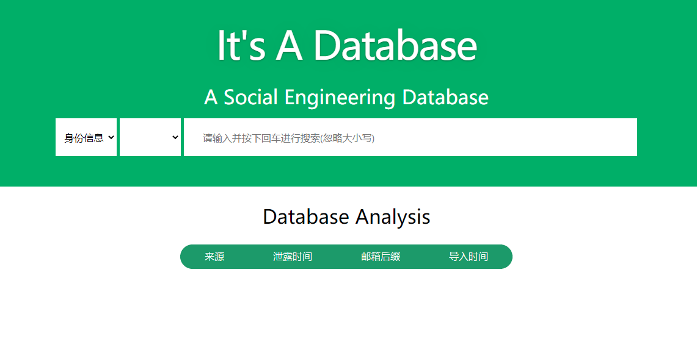
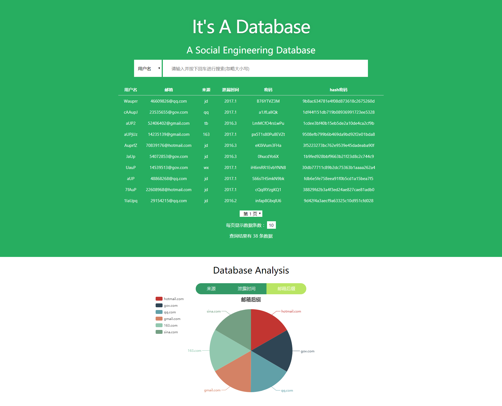

# Social Engineering Database

## Backend
- Using language: python 3.5

- Using database: MongoDB

- Requirements: pymongo, flask, Flask-RESTful

## 安装
## 源码安装
- 本地安装配置mongo，数据库名为socialdb   info个人信息表  person账号密码表
- 前端npm install ，在dist/serverConfig.json修改配置后端接口地址
- 后端安装python依赖，python3 -m pip install -r requirements.txt。python3 api_main.py启动后端接口
## docker部署安装
**直接从Docker Hub pull 镜像**

```bash
sudo docker push kalagin/socialdb_vue_flask:v1.4
```

**宿主机启动mongo服务**

**运行镜像**

```bash
   sudo docker run -ti -p 80:80 -e  MONGODB_URI=mongodb://192.168.32.132:27017 -d socialdb_vue_flask:v1.4
  MONGODB_URI填自己的mongo地址，不是127.0.0.1，而是宿主机内网地址
```

**进入docker CONTAINER**

```bash
sudo docker exec -it CONTAINER_ID  bash
cd ../client/dist/
#修改serverConfig.json文件中baseUrl，直接ip/域名/api即可
exit
```

**重启CONTAINER**

```bash
 sudo docker restart -it CONTAINER_ID
```

  **访问宿主机80端口**

## Frontend
- Using vue.js
- Requirements: axios, echarts

## Frontend Preview



## Make it better
1. SQL query not safe enough.
2. Inefficient SQL query.
3. Backend interface limit.
4. Frontend search waiting layout.
